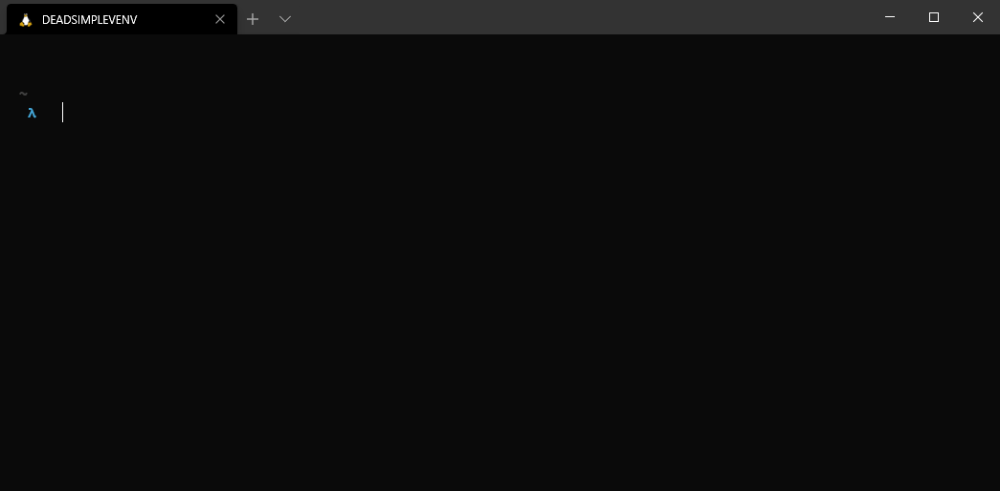

# 💀💀💀 deadsimplevenv

> Simple wrapper for python venv

If you want to automate python project structure creation and great projects as [POETRY](https://python-poetry.org/) are too heavy for you or cannot be used in your envinronment, you can try **deadsimplevenv**. It does not add anything special and it stucks with basic python setuptools 🛠.

## How to use



## What it does for me

1. It will create following folder structure by default:

    ```shell
    .
    ├── .cz.toml
    ├── .git
    ├── .gitignore
    ├── .venv
    ├── LICENSE
    ├── README.md
    ├── my_ultra_mega_project
    │   └── __ini__.py
    ├── setup.cfg
    └── setup.py
    ```

2. It will create venv and install/upgrade following packages (you can add/remove packages in your [config](#config-file)):
  
   - pip
   - setuptools
   - wheel
   - black
   - pylint
   - commitizen
  
3. It will connect to your devops platform (github or gitlab) and create project and make initial commit.

## Installation

```shell
# Make dir for deadsimplevenv
λ  mkdir deadsimplevenv && cd deadsimplevenv
# Use python -m venv for the last time :))
λ  python -m venv .venv && source .venv/bin/activate
# Install deadsimplevenv
λ[.venv]  pip install deadsimplevenv

# OPTIONAL - make alias for deadsimplevenv
λ[.venv]  which deadsimplevenv
/path/to/the/deadsimplevenv/.venv/bin/deadsimplevenv
λ[.venv]  echo "alias deadsimplevenv=/path/to/the/deadsimplevenv/.venv/bin/deadsimplevenv" >> ~/.bashrc
λ[.venv]  source ~/.bashrc
```

## Token needed

You need to specify [gitlab](https://docs.gitlab.com/ee///////user/profile/personal_access_tokens.html) or [github](https://docs.github.com/en/free-pro-team@latest/github/authenticating-to-github/creating-a-personal-access-token) token in the [config file](#config-file).

## Options

| Options:                           |                             |                 |     |     |
| ---------------------------------- | --------------------------- | --------------- | --- | --- |
| -p, --project PATH                 | Project name                |                 |     |     |
| -d, --description TEXT             | Brief project description   |                 |     |     |
| -u, --username TEXT                | Your username               |                 |     |     |
| -n, --name TEXT                    | Your full name              |                 |     |     |
| -e, --email TEXT                   | Your email adress           |                 |     |     |
| -l, --license [MIT\|GNU\|EMPTY]    | Project license             |                 |     |     |
| --devops_platform [github\|gitlab] |                             |                 |     |     |
| Your devops platform               |                             |                 |     |     |
| --devops_url TEXT                  | Your devops url             |                 |     |     |
| --devops_group TEXT                | Your devops group           |                 |     |     |
| --makerepo / --norepo              | Create repo in DEVOPS       | [default: True] |     |     |
| --private / --public               | Create repo in DEVOPS       | [default: True] |     |     |
| --help                             | Show this message and exit. |                 |     |     |

## Config file

You can make your own config file in default config locations for each platform:

- Other Unix: $XDG_CONFIG_HOME/app and ~/.config/app
- OS X: ~/.config/app and ~/Library/Application Support/app

Check example config in examples folder for possible parameters.
